# Déployer une application web Node.js + MongoDB sur Azure

## 1. Exécution de l'exemple

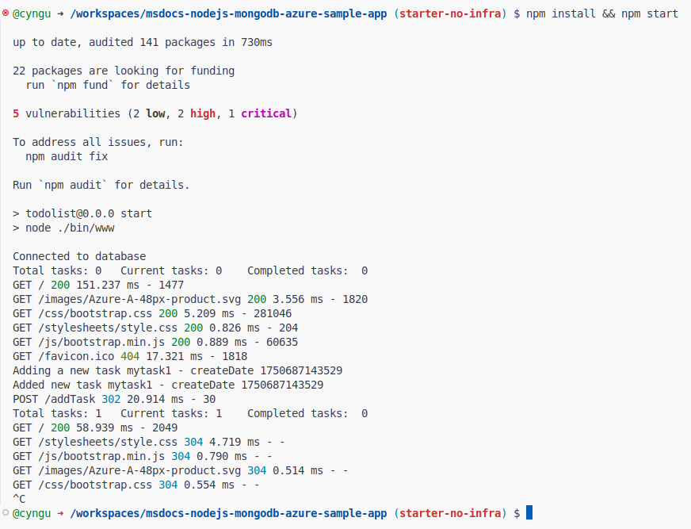

## 2. Créer App Service et Azure Cosmos DB

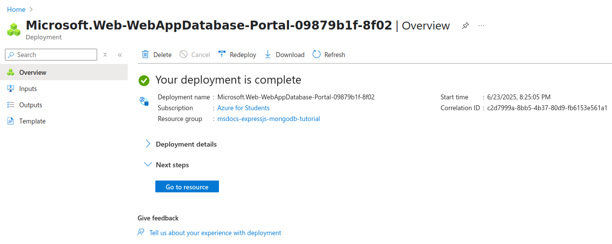

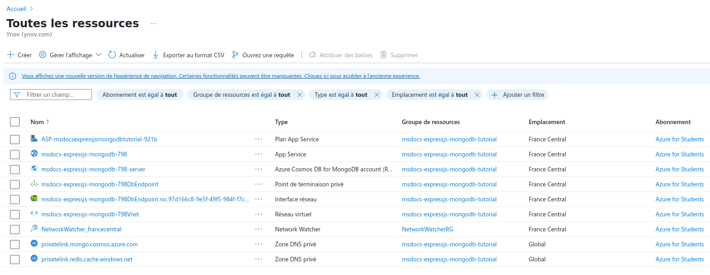

## 3. Secrets de la connexion sécurisée

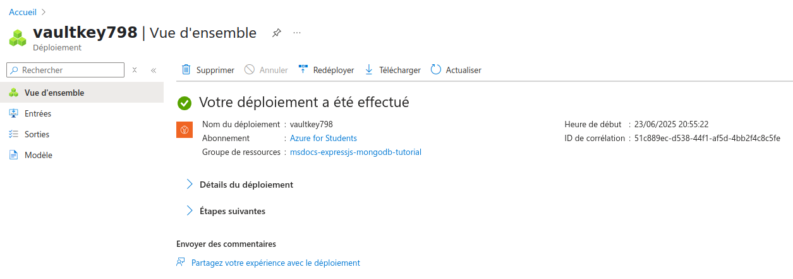

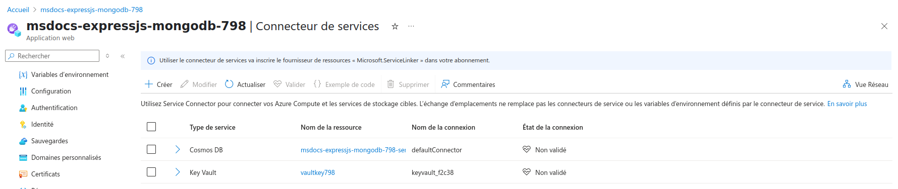

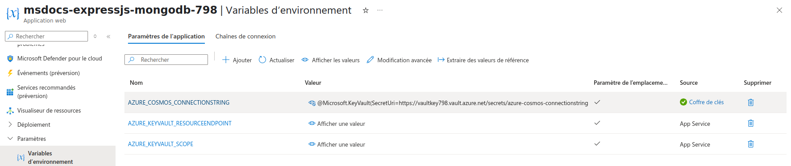

## 4. Déployer l’exemple de code

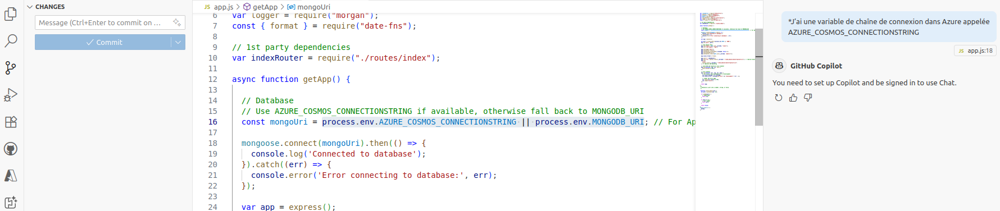

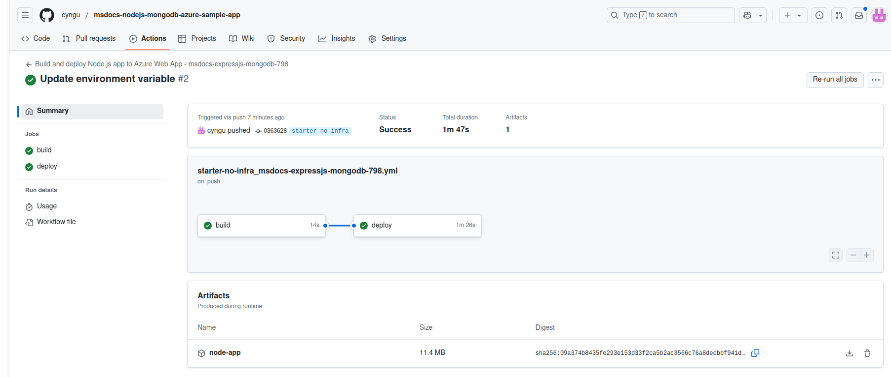

## 5. Accéder à l’application

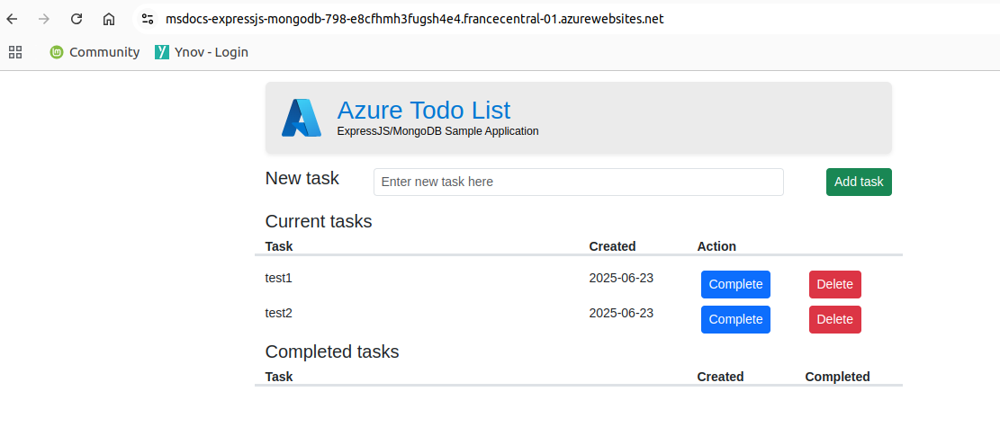

## 6. Diffuser en continu des journaux de diagnostic

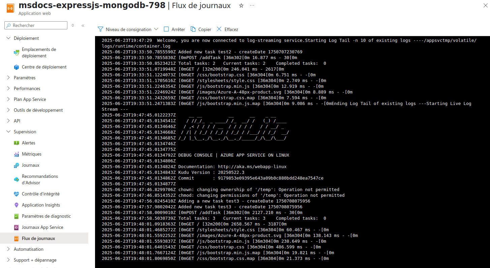

## 7. Inspecter les fichiers déployés à l’aide de Kudu

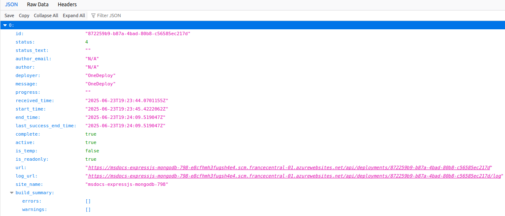

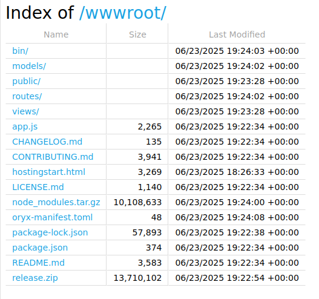

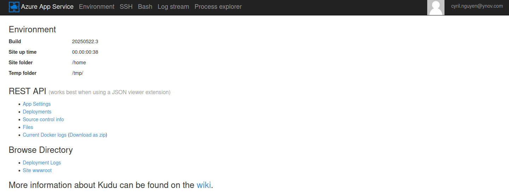

## 8. Nettoyer les ressources

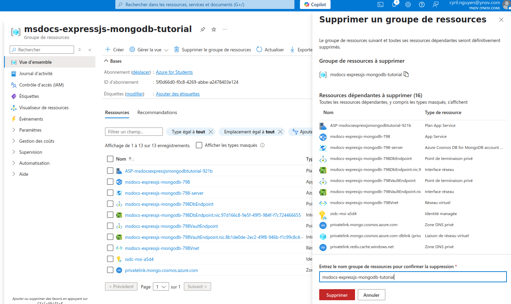